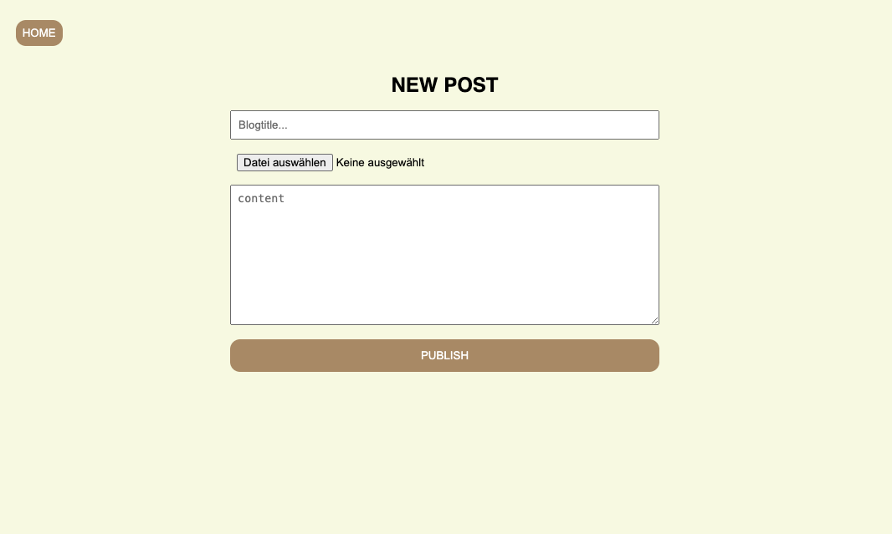

# Backend-Project: Blog 📰

- This project was created as part of a Full-Stack Webdeveloper bootcamp from supercode on day 9 of the backend part of the course.

- The learning objective of the project:
- combination of backend and frontend
- become more experienced with express.js
- upload files to a server with multer

## How does the Blog-Page work? ⚙️

- Visitors can see an overview of the posts when they visit the site.
- Visitors have the option of clicking on a post to go to the detailed view of the post.

- The admin can create posts via a separate page.
- The page can be accessed by anyone, as no authentication has yet been created.
- The admin can provide a post with a title, a post image and a text.
- The admin can send the post by clicking on a "Publish" button.
- A look into the toolbox:

1. frontend: React, react-router-dom
2. backend: Node.js, Express.js, Cors, Multer

## Demo:

- not deployed yet... to have a look on the project you need to clone it :)

## Screenshots 📸

## Copatible Screensizes 📱🖥️

- Desktop

## Tech Stack 💻

- react
- vite
- VS Code
- HTML
- SCSS
- JavaScript
- Git
- node.js
- express.js

## Author 🤵‍♀️

- [@cecilestaller](https://github.com/cecilestaller)
